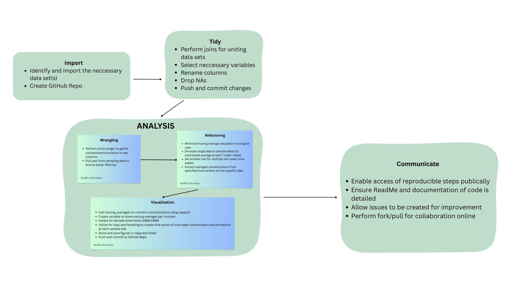
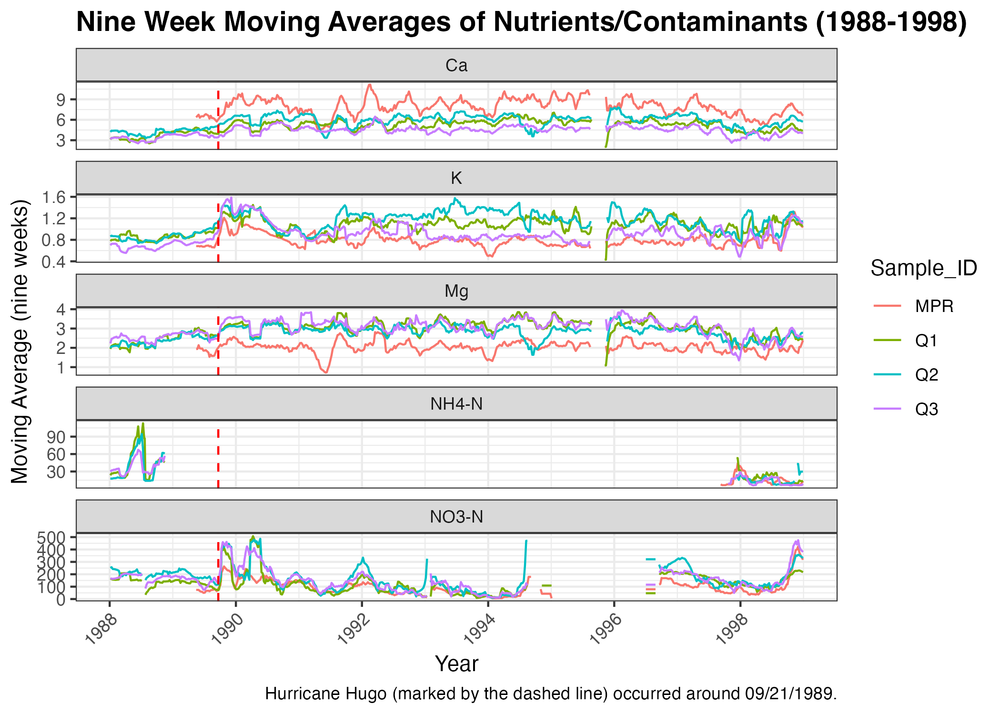

# Analytical-Workflows-Project-Practice

This project serves to replicate a prior figure completed by Schaefer et al. (2000) based on data published by McDowell et al. (2024). Moving nine-week averages were created for each concentration of contaminants (hereby referred to as "nutrients") at different streams in Puerto Rico before and after Hurricane Hugo. The primary objective is to establish a reproducible workflow that is replicable for interested environmental enthusiasts.

# Background

Hurricane Hugo (1989) greatly affected Puerto Rico's freshwater systems. The extent of the hurricane's impact can be visualized as moving averages (smoothed estimations) of changes in concentrations of contaminants over time at differently sampled streams. This can be replicated from an existing figure created by Schaefer et al.:


# Data

The data is publicly available on the EDI Data Portal and appears as separate files for each sampling site. For this analysis, the "QuebradaCuenca1-Bisley.csv", "QuebradaCuenca2-Bisley.csv", "QuebradaCuenca3-Bisley.csv", and "RioMameyesPuenteRoto.csv" were downloaded for the Q1, Q2, Q3, and MPR sample sites. Each data set contained the following shared columns necessary for the analysis:

-   `Sample_Date`: The specific sample date stored as a "date" type in YYYY-MM-DD format. Sampling was not evenly spaced out; for example some samples were sometimes taken months apart.

-   `Sample_ID`: The sample location, taken at four different locations in the Puerto Rico watershed.

-   `nutrients`: Categorical variable storing each nutrient that was sampled at each site as levels. The original data files stored these contaminants as individual nutrients with concentrations: K (potassium), Mg (magnesium), Ca (calcium), NO3-N (nitrate), and NH4-N (ammonia nitrate).

-   `concentration`: Numeric variable created from performing pivot_longer() to gather nutrient columns and separate concentrations and prevent spread. This column contains each numeric concentration associated with its associated nutrient.

-   Separately created columns:

    -   `moving_avg_nutrients`: This column stores all the nine week moving average concentrations for each nutrient produced from running the `moving_avg()` on `qb_mpr$Sample_Date` using `sapply()`.

    -   `year_sample`: The extracted year from `Sample_Date` to enable easier filtering for isolating the data set to a ten year time frame.

# Contents

-   `paper`: Contains `paper.qmd` of objectives (background and data), methods, and results of the analysis.

-   `docs`: Rendered html file of paper generated here for reference.

-   `scratch`: Remote function used for calculations and "spaghetti code" (rough draft of all code) are stored here.

-   `figs`: Contains graphs associated with yearly and nine-week moving averages per contaminant at each site.

-   `data`: All raw data files are stored here.

-   `assessment`: Contains assessment for self-check of project goals.

-   `R`: This folder contains a data cleaning script and a script for package installation required for the analysis.

# Analysis

The `tidyverse` package was used to perform data tidying and wrangling to simplify the analysis. It was necessary to perform `pivot_longer()` to group all nutrients under a shared column and store the concentration values separately in order to create a singular column for associated moving averages. `Sample_Date, nutrients, concentration,` and `Sample_ID` were selected to perform the moving average analysis, where each nutrient would have an associated moving average concentration for a specific sampling date based on the original concentration. Additionally, a new variable `year_sample` was created by pulling the year from the sampling date for the ease of filtering during visualization.

`moving_avg()`was locally sourced from `R\moving_avg.R`. The associated syntax is located in the `moving_avg.R` script. The function takes a singular focal date (index) in `Sample_Date` and checks whether sample dates before and after that focal date are within 4.5 weeks of each other to calculate a centered average for that nutrient. The function was written to include `window_size`, a parameter adjusting for the desired length required to calculate a moving average. Additional information is linked [here](https://github.com/vedikaS-byte/Analytical-Workflows-Project-Practice/blob/main/R/moving_avg.R).

A new column called `moving_avg_nutrients` was created by calling `sapply()` to apply `moving_avg()` to every nutrient in the data set. `Sample_Date` stored the sampled dates, concentration was set to `conc`, and the `window_size` was specified for nine weeks. A new data set called `qb_mpr_ma` was created to store `moving_avg_nutrients` and was used in recreating the visualization. All associated figures are included in `figs`.



# Results & Supporting Code

The resulting faceted graph was produced from the analysis. Generally, MPR had higher average concentrations of calcium, while Q3 had higher average concentrations of potassium, magnesium, and nitrate in the years following Hurricane Hugo. Increased rainfall, pollution, and drought are potential external influences of fluctuating averaged concentrations in the decade following Hurricane Hugo. Note that an exact match was not possible for moving averaged concentrations of NH4-N due to confounding factors, such as missing concentrations for sampling dates and resulting `NaN` types from the moving average calculation. As a result, future improvements to `moving_avg()` may be included to enhance the accuracy of mean calculations for specified intervals.



Below is supporting code to produce separate visualizations for each contaminant/nutrient for every sample site (also provided in `paper.qmd`):

```{r}
# create list of nutrients (just want the levels)
nutrient_list <- unique(qb_mpr_ma$nutrients)
hugo <- as.Date("1989-09-20")
for (i in nutrient_list) {
  # i is not a position but a "type" of nutrient
  plot_store <- qb_mpr_ma %>% mutate(year_sample = year(Sample_Date)) %>%
    filter(nutrients == i, year_sample >= 1988 & year_sample <= 1998) %>%
    #drop_na(moving_avg_nutrients) %>% 
    ggplot(aes(x = Sample_Date, y = moving_avg_nutrients, col = Sample_ID, group = Sample_ID)) +
    geom_line() +
    labs(title = paste("Moving Average of", i),
         y = "9 Wk Moving Average",
         x = "Year", caption = "Hurricane Hugo (marked by the dashed line) occurred around 09/21/1989.") + 
    theme_bw() + geom_vline(xintercept = hugo, linetype = "dashed", col = "red") 
 
   print(plot_store) 
  ggsave(filename = paste0("plot ", i, ".png"), path = here::here("figs"), plot = plot_store)
}
```

# Citation

McDowell, William H., and USDA Forest Service. International Institute Of Tropical Forestry (IITF). 2024. “Chemistry of Stream Water from the Luquillo Mountains.” Environmental Data Initiative. <https://doi.org/10.6073/PASTA/F31349BEBDC304F758718F4798D25458>.

Schaefer, Douglas. A., William H. McDowell, Fredrick N. Scatena, and Clyde E. Asbury. 2000. “Effects of Hurricane Disturbance on Stream Water Concentrations and Fluxes in Eight Tropical Forest Watersheds of the Luquillo Experimental Forest, Puerto Rico.” *Journal of Tropical Ecology* 16 (2): 189–207. <https://doi.org/10.1017/s0266467400001358>.
